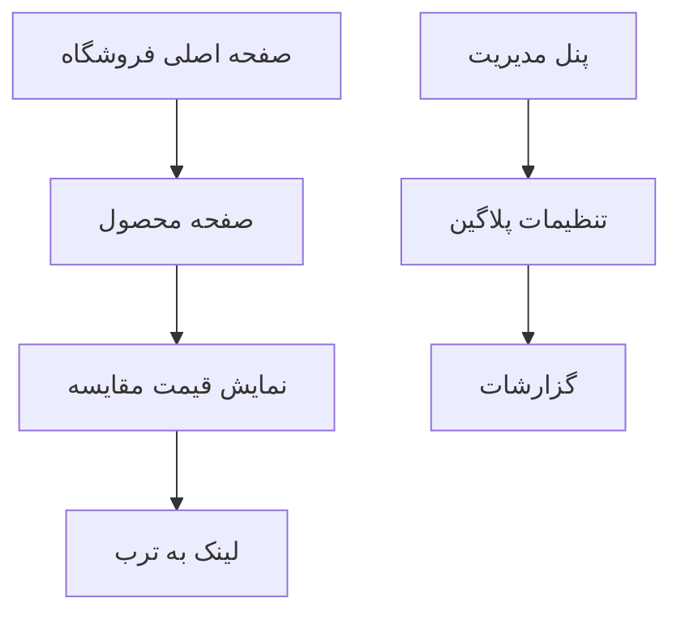

# مستند الزامات محصول - پلاگین مقایسه قیمت ترب برای ووکامرس

## 1. نمای کلی محصول
پلاگین مقایسه قیمت ترب برای ووکامرس که به طور خودکار محصولات فروشگاه را در وبسایت ترب جستجو کرده و کمترین قیمت موجود را در صفحه محصول نمایش می‌دهد.

این پلاگین به فروشندگان کمک می‌کند تا قیمت‌گذاری رقابتی داشته باشند و به مشتریان اطمینان می‌دهد که بهترین قیمت را دریافت می‌کنند.

هدف: افزایش فروش و رضایت مشتری از طریق شفافیت قیمت و مقایسه با بازار.

## 2. ویژگی‌های اصلی

### 2.1 نقش‌های کاربری
| نقش | روش ثبت‌نام | دسترسی‌های اصلی |
|-----|-------------|------------------|
| مدیر فروشگاه | دسترسی مدیریت وردپرس | تنظیمات پلاگین، فعال/غیرفعال کردن مقایسه قیمت، مشاهده گزارشات |
| مشتری | بدون نیاز به ثبت‌نام | مشاهده قیمت‌های مقایسه شده در صفحه محصول |

### 2.2 ماژول‌های ویژگی
الزامات پلاگین ما شامل صفحات اصلی زیر است:
1. **صفحه تنظیمات مدیریت**: پنل کنترل پلاگین، تنظیمات API، مدیریت کش
2. **صفحه محصول**: نمایش قیمت مقایسه، لینک به ترب، نمایش آخرین بروزرسانی
3. **صفحه گزارشات**: آمار جستجوها، عملکرد API، تاریخچه قیمت‌ها

### 2.3 جزئیات صفحات
| نام صفحه | نام ماژول | توضیحات ویژگی |
|-----------|-----------|----------------|
| صفحه تنظیمات مدیریت | پنل کنترل | تنظیم کلید API ترب، فعال/غیرفعال کردن پلاگین، تنظیم زمان کش |
| صفحه تنظیمات مدیریت | مدیریت کش | پاک کردن کش، تنظیم مدت زمان کش، مشاهده وضعیت کش |
| صفحه تنظیمات مدیریت | تنظیمات نمایش | انتخاب موقعیت نمایش قیمت، سفارشی‌سازی متن نمایشی |
| صفحه محصول | نمایش قیمت مقایسه | دریافت و نمایش کمترین قیمت از ترب، نمایش تاریخ آخرین بروزرسانی |
| صفحه محصول | لینک به ترب | ایجاد لینک مستقیم به صفحه جستجوی محصول در ترب |
| صفحه گزارشات | آمار جستجوها | نمایش تعداد جستجوهای انجام شده، محصولات پیدا شده |
| صفحه گزارشات | عملکرد API | نمایش وضعیت اتصال به API، زمان پاسخ، خطاها |

## 3. فرآیند اصلی
فرآیند اصلی کاربر شامل موارد زیر است:

**فرآیند مدیر فروشگاه:**
1. نصب و فعال‌سازی پلاگین
2. تنظیم کلید API ترب در پنل مدیریت
3. انتخاب محصولاتی که باید مقایسه قیمت شوند
4. مشاهده گزارشات و آمار

**فرآیند مشتری:**
1. ورود به صفحه محصول
2. مشاهده قیمت فروشگاه و قیمت مقایسه شده از ترب
3. تصمیم‌گیری برای خرید

## 4. طراحی رابط کاربری
### 4.1 سبک طراحی
- رنگ‌های اصلی: آبی (#0073aa) و سبز (#00a32a) برای نمایش قیمت‌های مناسب
- رنگ‌های فرعی: خاکستری (#666) برای متن‌های توضیحی
- سبک دکمه‌ها: گرد با شعاع 4px
- فونت: فونت پیش‌فرض وردپرس (IRANSans برای فارسی)
- اندازه فونت ترجیحی: 14px برای متن عادی، 16px برای عناوین
- سبک چیدمان: کارت‌محور با فاصله‌گذاری مناسب
- آیکون‌ها: استفاده از آیکون‌های Dashicons وردپرس

### 4.2 نمای کلی طراحی صفحات
| نام صفحه | نام ماژول | عناصر رابط کاربری |
|-----------|-----------|--------------------|
| صفحه تنظیمات مدیریت | پنل کنترل | فرم تنظیمات با فیلدهای ورودی، دکمه‌های ذخیره و بازنشانی، پیام‌های وضعیت |
| صفحه محصول | نمایش قیمت مقایسه | باکس اطلاعات قیمت با پس‌زمینه سبز روشن، آیکون ترب، متن "کمترین قیمت در ترب" |
| صفحه گزارشات | آمار جستجوها | جدول آمار با ستون‌های تاریخ، تعداد جستجو، موفقیت، نمودار خطی عملکرد |

### 4.3 پاسخگویی
پلاگین برای استفاده در دسکتاپ طراحی شده و با موبایل سازگار است. بهینه‌سازی لمسی برای تعامل با دکمه‌ها و لینک‌ها در نظر گرفته شده است.