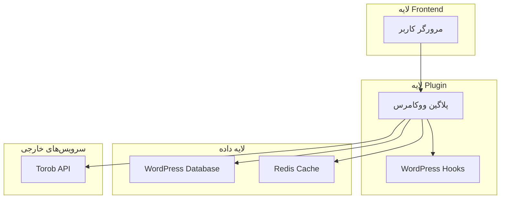
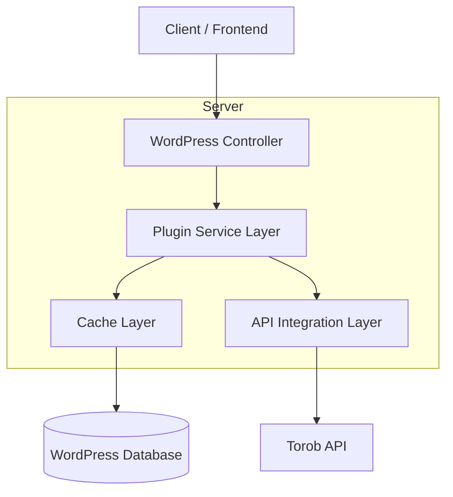
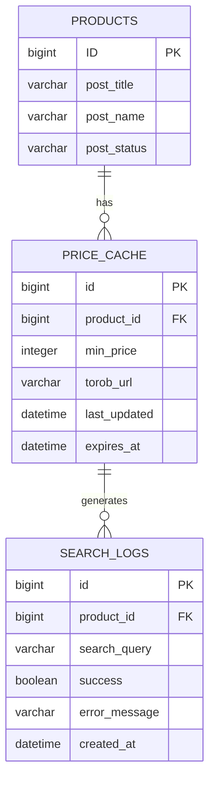

# مستند معماری فنی - پلاگین مقایسه قیمت ترب برای ووکامرس

## 1. طراحی معماری



## 2. شرح تکنولوژی
- Frontend: PHP@8.0+ + WordPress@6.0+ + WooCommerce@7.0+
- Backend: WordPress Plugin Architecture
- Database: WordPress Database (MySQL)
- Cache: WordPress Transients API / Redis (اختیاری)
- External API: Torob.com API

## 3. تعریف مسیرها
| مسیر | هدف |
|------|------|
| /wp-admin/admin.php?page=torob-price-compare | صفحه تنظیمات پلاگین در پنل مدیریت |
| /wp-admin/admin.php?page=torob-reports | صفحه گزارشات و آمار |
| /product/{product-slug} | صفحه محصول با نمایش قیمت مقایسه |
| /wp-admin/admin-ajax.php | AJAX endpoints برای عملیات پس‌زمینه |

## 4. تعریف APIها

### 4.1 Core API

جستجوی قیمت محصول در ترب
```
POST /wp-admin/admin-ajax.php
```

Request:
| نام پارامتر | نوع پارامتر | الزامی | توضیحات |
|-------------|-------------|--------|----------|
| action | string | true | torob_search_price |
| product_id | integer | true | شناسه محصول ووکامرس |
| product_name | string | true | نام محصول برای جستجو |
| nonce | string | true | WordPress security nonce |

Response:
| نام پارامتر | نوع پارامتر | توضیحات |
|-------------|-------------|----------|
| success | boolean | وضعیت موفقیت درخواست |
| data | object | اطلاعات قیمت و لینک |
| min_price | integer | کمترین قیمت یافت شده |
| torob_url | string | لینک به صفحه ترب |
| last_updated | string | زمان آخرین بروزرسانی |

مثال:
```json
{
  "success": true,
  "data": {
    "min_price": 150000,
    "torob_url": "https://torob.com/search/?query=product-name",
    "last_updated": "2024-01-15 10:30:00"
  }
}
```

ذخیره تنظیمات پلاگین
```
POST /wp-admin/admin-ajax.php
```

Request:
| نام پارامتر | نوع پارامتر | الزامی | توضیحات |
|-------------|-------------|--------|----------|
| action | string | true | torob_save_settings |
| api_enabled | boolean | true | فعال/غیرفعال بودن پلاگین |
| cache_duration | integer | true | مدت زمان کش (ساعت) |
| display_position | string | true | موقعیت نمایش (before_price, after_price) |
| nonce | string | true | WordPress security nonce |

Response:
| نام پارامتر | نوع پارامتر | توضیحات |
|-------------|-------------|----------|
| success | boolean | وضعیت موفقیت ذخیره |
| message | string | پیام نتیجه |

## 5. نمودار معماری سرور



## 6. مدل داده

### 6.1 تعریف مدل داده



### 6.2 زبان تعریف داده

جدول کش قیمت‌ها (torob_price_cache)
```sql
-- ایجاد جدول
CREATE TABLE wp_torob_price_cache (
    id BIGINT(20) UNSIGNED NOT NULL AUTO_INCREMENT,
    product_id BIGINT(20) UNSIGNED NOT NULL,
    min_price INT(11) DEFAULT NULL,
    torob_url VARCHAR(500) DEFAULT NULL,
    search_query VARCHAR(255) NOT NULL,
    last_updated DATETIME DEFAULT CURRENT_TIMESTAMP,
    expires_at DATETIME NOT NULL,
    PRIMARY KEY (id),
    KEY idx_product_id (product_id),
    KEY idx_expires_at (expires_at)
) ENGINE=InnoDB DEFAULT CHARSET=utf8mb4 COLLATE=utf8mb4_unicode_ci;

-- ایجاد ایندکس
CREATE INDEX idx_torob_cache_product_expires ON wp_torob_price_cache(product_id, expires_at);
CREATE INDEX idx_torob_cache_updated ON wp_torob_price_cache(last_updated DESC);
```

جدول لاگ جستجوها (torob_search_logs)
```sql
-- ایجاد جدول
CREATE TABLE wp_torob_search_logs (
    id BIGINT(20) UNSIGNED NOT NULL AUTO_INCREMENT,
    product_id BIGINT(20) UNSIGNED NOT NULL,
    search_query VARCHAR(255) NOT NULL,
    success TINYINT(1) DEFAULT 0,
    error_message TEXT DEFAULT NULL,
    response_time INT(11) DEFAULT NULL,
    created_at DATETIME DEFAULT CURRENT_TIMESTAMP,
    PRIMARY KEY (id),
    KEY idx_product_id (product_id),
    KEY idx_created_at (created_at DESC),
    KEY idx_success (success)
) ENGINE=InnoDB DEFAULT CHARSET=utf8mb4 COLLATE=utf8mb4_unicode_ci;

-- داده‌های اولیه
INSERT INTO wp_options (option_name, option_value, autoload) VALUES 
('torob_price_compare_settings', '{"api_enabled":true,"cache_duration":24,"display_position":"after_price","auto_update":true}', 'yes'),
('torob_price_compare_version', '1.0.0', 'yes');
```